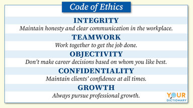

# Ethics in Tech

### Code of Ethics

A code of ethics is a set of principles and rules used by individuals and organizations to govern their decision-making process, 
as well as to distinguish right from wrong. They provide a general idea of the ethical standards of a business or organization.
 However, people can have their own personal code of ethics as well. Keep reading for a more thorough explanation of a code of 
 ethics, as well as several code of ethics examples.

### Professional Codes of Ethics
Several professions have a code of ethics that exists independent of any particular employment. For instance, a doctor or lawyer 
is always bound by the code of ethics for their profession, regardless of whether they work for a large organization or are in 
private practice. These codes constitute the basic expectations of these jobs and guide them when making decisions.

### GENERAL ETHICAL PRINCIPLES :

1. Contribute to society and to human well-being, acknowledging that all people are stakeholders in computing.
2. Avoid harm.
3. Be honest and trustworthy.
4. Be fair and take action not to discriminate.
5. Respect the work required to produce new ideas, inventions, creative works, and computing artifacts.
6. Respect privacy.
7. Honor confidentiality.

### PROFESSIONAL RESPONSIBILITIES :

1. Strive to achieve high quality in both the processes and products of professional work.
2. Maintain high standards of professional competence, conduct, and ethical practice.
3. Know and respect existing rules pertaining to professional work.
4. Accept and provide appropriate professional review.
5. Give comprehensive and thorough evaluations of computer systems and their impacts, including analysis of possible risks.
6. Perform work only in areas of competence.
7. Foster public awareness and understanding of computing, related technologies, and their consequences.
8. Access computing and communication resources only when authorized or when compelled by the public good.
9. Design and implement systems that are robustly and usably secure.

### PROFESSIONAL LEADERSHIP PRINCIPLES :

1. Ensure that the public good is the central concern during all professional computing work.
2. Articulate, encourage acceptance of, and evaluate fulfillment of social responsibilities by members of the organization or group.
3. Manage personnel and resources to enhance the quality of working life.
4. Articulate, apply, and support policies and processes that reflect the principles of the Code.
5. Create opportunities for members of the organization or group to grow as professionals.
6. Use care when modifying or retiring systems.
7. Recognize and take special care of systems that become integrated into the infrastructure of society.

### COMPLIANCE WITH THE CODE.

1. Uphold, promote, and respect the principles of the Code.
2. Treat violations of the Code as inconsistent with membership in the ACM.

## ACM Code of Ethics and Professional Conduct

### Preamble
Computing professionals' actions change the world. To act responsibly, they should reflect upon the wider impacts of their work, 
consistently supporting the public good. The ACM Code of Ethics and Professional Conduct ("the Code") expresses the conscience of 
the profession. The Code is designed to inspire and guide the ethical conduct of all computing professionals, including current 
and aspiring practitioners, instructors, students, influencers, and anyone who uses computing technology in an impactful way. 
Additionally, the Code serves as a basis for remediation when violations occur. The Code includes principles formulated as 
statements of responsibility, based on the understanding that the public good is always the primary consideration. Each principle 
is supplemented by guidelines, which provide explanations to assist computing professionals in understanding and applying the 
principle. Section 1 outlines fundamental ethical principles that form the basis for the remainder of the Code. Section 2 
addresses additional, more specific considerations of professional responsibility. Section 3 guides individuals who have a 
leadership role, whether in the workplace or in a volunteer professional capacity. Commitment to ethical conduct is required of
every ACM member, and principles involving compliance with the Code are given in Section 4. The Code as a whole is concerned 
with how fundamental ethical principles apply to a computing professional's conduct. The Code is not an algorithm for solving 
ethical problems; rather it serves as a basis for ethical decision-making. When thinking through a particular issue, a computing 
professional may find that multiple principles should be taken into account, and that different principles will have different 
relevance to the issue. Questions related to these kinds of issues can best be answered by thoughtful consideration of the 
fundamental ethical principles, understanding that the public good is the paramount consideration. The entire computing 
profession benefits when the ethical decision-making process is accountable to and transparent to all stakeholders. Open 
discussions about ethical issues promote this accountability and transparency.

### 1. GENERAL ETHICAL PRINCIPLES :

*1.1 Contribute to society and to human well-being, acknowledging that all people are stakeholders in computing.*

This principle, which concerns the quality of life of all people, affirms an obligation of computing professionals, both 
individually and collectively, to use their skills for the benefit of society, its members, and the environment surrounding them. 
This obligation includes promoting fundamental human rights and protecting each individual's right to autonomy. An essential aim 
of computing professionals is to minimize negative consequences of computing,

*1.2 Avoid harm.*

In this document, "harm" means negative consequences, especially when those consequences are significant and unjust. Examples of 
harm include unjustified physical or mental injury, unjustified destruction or disclosure of information, and unjustified damage 
to property, reputation, and the environment. This list is not exhaustive.

*1.3 Be honest and trustworthy.*

Honesty is an essential component of trustworthiness. A computing professional should be transparent and provide full disclosure 
of all pertinent system capabilities, limitations, and potential problems to the appropriate parties. Making deliberately false 
or misleading claims, fabricating or falsifying data, offering or accepting bribes, and other dishonest conduct are violations of 
the Code.

*1.4 Be fair and take action not to discriminate.*

The values of equality, tolerance, respect for others, and justice govern this principle. Fairness requires that even careful 
decision processes provide some avenue for redress of grievances.

*1.5 Respect the work required to produce new ideas, inventions, creative works, and computing artifacts.*

Developing new ideas, inventions, creative works, and computing artifacts creates value for society, and those who expend this 
effort should expect to gain value from their work. Computing professionals should therefore credit the creators of ideas, 
inventions, work, and artifacts, and respect copyrights, patents, trade secrets, license agreements, and other methods of 
protecting authors' works.

*1.6 Respect privacy.*

The responsibility of respecting privacy applies to computing professionals in a particularly profound way. Technology enables 
the collection, monitoring, and exchange of personal information quickly, inexpensively, and often without the knowledge of the 
people affected.

*1.7 Honor confidentiality.*

Computing professionals are often entrusted with confidential information such as trade secrets, client data, nonpublic business 
strategies, financial information, research data, pre-publication scholarly articles, and patent applications.

### 2. PROFESSIONAL RESPONSIBILITIES :

*2.1 Strive to achieve high quality in both the processes and products of professional work.*

Computing professionals should insist on and support high quality work from themselves and from colleagues. The dignity of 
employers, employees, colleagues, clients, users, and anyone else affected either directly or indirectly by the work should be 
respected throughout the process. Computing professionals should respect the right of those involved to transparent communication 
about the project.

*2.2 Maintain high standards of professional competence, conduct, and ethical practice.*

High quality computing depends on individuals and teams who take personal and group responsibility for acquiring and maintaining 
professional competence.

*2.3 Know and respect existing rules pertaining to professional work.*

"Rules" here include local, regional, national, and international laws and regulations, as well as any policies and procedures of 
the organizations to which the professional belongs.

*2.4 Accept and provide appropriate professional review.*
High quality professional work in computing depends on professional review at all stages. Whenever appropriate, computing 
professionals should seek and utilize peer and stakeholder review. Computing professionals should also provide constructive, 
critical reviews of others' work.

*2.5 Give comprehensive and thorough evaluations of computer systems and their impacts, including analysis of possible risks.*

*2.6 Perform work only in areas of competence.*

A computing professional is responsible for evaluating potential work assignments.

*2.7 Foster public awareness and understanding of computing, related technologies, and their consequences.*

*2.8 Access computing and communication resources only when authorized or when compelled by the public good.*

*2.9 Design and implement systems that are robustly and usably secure. *

### 3. PROFESSIONAL LEADERSHIP PRINCIPLES :

*3.1 Ensure that the public good is the central concern during all professional computing work.*

People—including users, customers, colleagues, and others affected directly or indirectly should always be the central concern in 
computing

*3.2 Articulate, encourage acceptance of, and evaluate fulfillment of social responsibilities by members of the organization or*
*group.*

*3.3 Manage personnel and resources to enhance the quality of working life.*

*3.4 Articulate, apply, and support policies and processes that reflect the principles of the Code.*

Leaders should pursue clearly defined organizational policies that are consistent with the Code and effectively communicate them 
to relevant stakeholders.

*3.5 Create opportunities for members of the organization or group to grow as professionals.*

*3.6 Use care when modifying or retiring systems.*

Interface changes, the removal of features, and even software updates have an impact on the productivity of users and the quality 
of their work.

*3.7 Recognize and take special care of systems that become integrated into the infrastructure of society.*

### 4. COMPLIANCE WITH THE CODE :

*4.1 Uphold, promote, and respect the principles of the Code.*

The future of computing depends on both technical and ethical excellence. Computing professionals should adhere to the principles 
of the Code and contribute to improving them. Computing professionals who recognize breaches of the Code should take actions to 
resolve the ethical issues they recognize, including, when reasonable, expressing their concern to the person or persons thought 
to be violating the Code.

*4.2 Treat violations of the Code as inconsistent with membership in the ACM.*

Each ACM member should encourage and support adherence by all computing professionals regardless of ACM membership. ACM members 
who recognize a breach of the Code should consider reporting the violation to the ACM, which may result in remedial action as 
specified in the ACM's Code of Ethics and Professional Conduct Enforcement Policy.

## Project Dragonfly, Google’s censored search engine

Google is experiencing a “moral and ethical” crisis. That’s the view of hundreds of employees at the tech company, who are 
protesting the development of a censored search engine for internet users in China.

At a Senate Judiciary hearing earlier this week, Google's vice president of public policy, Karan Bhatia, confirmed that the tech
giant has abandoned work on its secret project codenamed Dragonfly, a censored search engine tailored for the Chinese market.

According to Bhatia, Google exited China in 2010 because the tech giant at that point, in addition to being under cyberattack, 
felt that the censorship requirements that were being applied to Google were not compatible with its mission at that time.

Obviously, things have evolved since then and, as investigative news site The Intercept discovered last year, Google started a 
secret project to launch a Chinese search engine dubbed Dragonfly in the spring of 2017 that filters out websites and search 
results about human rights, democracy, religion, and peaceful protest—all based on web censorship requirements imposed by the 
Chinese government.

### Google is still not prepared to commit not to engage in censorship in China in the future

Insisting that Google does not currently provide a search engine in mainland China—it does so from its subsidiary in 
Hong-Kong—Bhatia fell short though to commit that Google will not, in the future, participate in any form of censorship with the 
Chinese regime in China against Chinese citizens.

Atherton Research Insights

Although Google confirmed that its Dragonfly project has been terminated, the Silicon Valley giant fell short in committing not
to enter the Chinese search market in the future.

However, it's important to keep in mind that Microsoft's Bing search engine is currently available in China and that its search 
results are being censured following the Chinese government guidelines.

European search engine Qwant is another Western cloud search provider that is also allowed to operate in the Chinese market which
is currently dominated by Baidu.

### Amazon workers demand Jeff Bezos cancel “Recognition” software :

in May, an investigation by the American Civil Liberties Union revealed that Amazon had heavily marketed its Rekognition software
to police departments and government agencies. The technology can recognize and track faces in real time, and the ACLU noted 
that such a powerful surveillance tool could easily be misused by law enforcement.

Earlier this week, several Amazon shareholders called on the company to stop selling Rekognition to the police. That backlash has 
now spread among employees as well.

The Amazon workers’ letter follows employee activism at other major tech firms like Microsoft and Google. Earlier this week, 
Microsoft employees called on the company to cancel its cloud computing contract with Immigration and Customs Enforcement. CEO 
Satya Nadella defended Microsoft’s work with ICE, saying that his company merely provided the agency with routine tech services 
like email, calendar, and messaging.

And earlier this month, Google employees saw the success of internal activism against their company’s artificial intelligence 
contract with the Pentagon—at a staff meeting in June, Google Cloud CEO Diane Greene announced that the company would not renew
its contract for Project Maven, a Defense Department pilot program that uses artificial intelligence to analyze drone footage. 
Google also announced new ethics principles to govern its artificial intelligence work.

It’s not clear yet whether the employee campaigns at Amazon and Microsoft will have the same impact as the employee activism at 
Google—but the pushback at Amazon and Microsoft this week shows that tech employees are increasingly willing to speak up against 
work that they believe to be unethical.

### Google and AI :

Google’s mission is to organize the world’s information and make it universally accessible and useful. AI is helping us do that 
in exciting new ways, solving problems for our users, our customers, and the world.

AI is making it easier for people to do things every day, whether it’s searching for photos of loved ones, breaking down language 
barriers in Google Translate, typing emails on the go, or getting things done with the Google Assistant. AI also provides new 
ways of looking at existing problems, from rethinking healthcare to advancing scientific discovery.

### Microsoft Employees demand end of ICE contract :

More than 100 Microsoft employees protested the company's relationship with Immigration and Customs Enforcement in an open letter 
amid widening outrage over the agency's role in separating children from their migrant parents at the U.S.-Mexico border.

The letter, dated Tuesday and addressed to Microsoft CEO Satya Nadella, states "Microsoft must take an ethical stand, and put 
children and families above profits."

Thousands of children have been separated from their parents at the border due to the Trump administration's "zero-tolerance" 
policy of prosecuting those who enter the country illegally.

The employees not only asked Microsoft to cancel its contract with ICE but also to cancel contracts with clients who support the 
agency and to release and enforce "a clear policy stating that neither Microsoft nor its contractors will work with clients who 
violate international human rights law."

Microsoft has a $19.4 million contract with ICE for its Microsoft Azure product to be used for artificial intelligence, facial 
recognition and data processing. The letter states the "powerful capabilities" given to ICE through its contract allow the agency 
to "enact inhumane and cruel policies."

The employees state they have a responsibility to ensure that what they create is "used for good."

### Microsoft and the DoD :

A group of Microsoft employees are demanding that the company's leadership abandon a contract with the US Army that they say 
makes them into "war profiteers" — a contract that relates to Microsoft's HoloLens augmented-reality technology.

On Friday, a group of workers at the Redmond, Washington-based tech giant released an open letter in which they slammed a $749 
million contract the company holds to develop an "Integrated Visual Augmentation System" (IVAS) to build "a single platform that
Soldiers can use to Fight, Rehearse, and Train that provides increased lethality, mobility, and situational awareness necessary
to achieve overmatch against our current and future adversaries."

T*oday we support a host of critical national security programs, including:*

1. Partnering with the U.S. Army to rapidly prototype and field state-of-art mixed reality headsets, augmented by Azure, that provide soldiers access to a vast array of information and planning capabilities anywhere they are, to help improve situational awareness and increase soldier safety;

2. Enabling the DoD’s rapid shift to remote work through the deployment of the Continuous Virtual Remote environment, the 
“largest rollout ever implemented in this short amount of time,” as noted by the department’s then CIO, Dana Deasy;

3. Advancing digital transformation efforts and cloud-based productivity capabilities through the Defense Enterprise Office 
Solution, the DoD’s enterprise-wide solution to deploy Microsoft 365 software and services to their 3 million+ workforce;
Integrating our mission cloud capabilities through the department’s enterprise-wide Joint All Domain Command and Control (JADC2) 
efforts;

L4. eading a coalition of industry partners to ensure the security of the U.S. microelectronics supply chain for defense 
technologies;

5. Collaborating with the U.S. Air Force to scale IT modernization efforts, improve cloud performance, and empower better 
cross-agency collaboration and communication while complying with strict DoD requirements;

6. and Partnering with the U.S. Navy to successfully deploy an enhanced weather model in a production-like Microsoft Azure 
environment, showcasing the potential scaling weather and ocean pattern predictions on demand to deliver faster, real-time 
tropical cyclone forecasts.

## Ethics in Technology

### Self Driving Car Ethics :

Self-driving cars have captured people’s imagination for decades. In their minds, fully autonomous vehicles (AVs)—those in pop 
culture—will be able to operate themselves without any human intervention.

Despite the advances made in self-driving technology, there is still no car that is 100% fully autonomous today. While carmakers 
such as Tesla, General Motors, and Stellantis have developed features such as pedestrian detection, lane departure warnings, 
traffic sign recognition, and blind-spot detection, fully automated self-driving vehicles likely won’t be ready anytime before 
2030, according to Accenture’s estimation.

### *Pros and cons of driverless technology*
Driverless cars have the potential to transform society in positive ways. According to the United States’ National Highway 
Traffic Safety Administration, the benefits of self-driving cars range from increased mobility for seniors and the disabled to 
efficiency and convenience.

Higher levels of vehicle automation are also expected to increase road safety by reducing traffic accidents and, ultimately, 
preventing them altogether. In fact, research has shown that 94% of crashes are due to human error.

At the same time, driverless technology can be beneficial for society by lowering carbon emissions and paving the way for more 
sustainable ways of living.

In recent years, some technological progress has been observed in AV technologies. Many self-driving vehicles on the market are 
currently equipped with advanced driver-assistance systems, which prevent drivers from drifting out of their lanes or help them 
stop in time to avoid a crash or reduce its severity.

For example, General Motors has developed a system that allows its vehicles to control steering and acceleration. Honda has a 
Civic sedan with a suite of features such as Traffic Jam Assist, which manages the vehicle’s acceleration, braking, and steering.

Meanwhile, Tesla has its Autopilot feature, which has been marketed as having “Full Self-Driving” capability. Despite the 
marketing claims, Tesla’s “Full Self-Driving” function has only achieved Level 2 (Driver Assistance) out of six possible levels 
on the widely used automated driving taxonomy by The Society of Automotive Engineers (SAE). Specifically, Tesla’s vehicles still 
require a human to take control of the vehicle at any time.

### *Risks and challenges*

While there are potential economic and social benefits to driverless technologies, they could also present a myriad of risks.

Vehicle malfunctions, for instance, can be a safety hazard for road users. Last year, Tesla came under investigation after its 
vehicles operating on autopilot crashed into parked emergency vehicles. In February this year, 354 complaints were filed by Tesla 
owners over the past nine months over “phantom braking” in Tesla’s Model 3 and Model Y.

Self-driving cars are also vulnerable to cyberattacks as they are primarily software-driven products compared to traditional
cars. As they become increasingly dependent on software to operate, there are growing concerns that hacking and cyberattacks 
could compromise the proper functioning of self-driving cars, and pose a threat to both drivers and car manufacturers.

Another issue is the lack of clear regulations to govern the self-driving car industry. In a recent survey carried out by 
McKinsey & Company on the future of autonomous vehicles, many countries lack comprehensive regulations on safety and operating 
standards. For example, rules on autonomous cars across Europe remain fragmented. In the EU, a legislative framework specifically 
dedicated to the approval of AVs does not exist. In China, different regulations have also emerged at the municipal level.

### *Ethical complexities*
These risks also highlight the ethical challenges that carmakers and governments have to face in the development of driverless 
cars.

One such issue involves the testing of autonomous vehicles. For example, self-driving carmakers have been using public roads in 
the US as a test lab for self-driving experiments.

According to a recent report from the US Department of Motor Vehicles, self-driving car companies such as Waymo and Cruise nearly 
doubled their testing miles to a record 4.1 million miles on California roads from December 2020 through November 2021 compared 
to the previous year.

Despite their potential to improve road safety, the testing of AVs on public roads could put unwitting drivers at risk. This 
highlights the moral dilemma that carmakers, regulators, and the public face: Does AV regulation create safer roads for people, 
or will it slow the adoption of driverless technologies that can reduce traffic accidents?

Another major ethical issue in the development of self-driving vehicles involves the ability of machines in making moral 
decisions. While the introduction of autonomous vehicles may reduce the number of road accidents, such events cannot be ruled out
based on past records. For example, when self-driving cars developed by Waymo and Cruise were operating in San Francisco at 
record levels in 2021, 53 collisions ensued.

In the event of a crash, ethical decisions have to be made, which often puts people in a moral quandary, based on a study by 
researchers from the Massachusetts Institute of Technology.

Based on the “Moral Machine” online survey of 2.3 million people worldwide in 2018, respondents were presented with 13 scenarios 
in which a collision involving an autonomous vehicle killing a combination of passengers and pedestrians was unavoidable. The 
participants were asked who they would spare.

A significant finding from the survey was that moral principles that guided drivers’ decisions varied from country to country. 
Another was how women and men viewed ethical and moral situations differently.

Hence, without a consensus on a universal moral code, this would make it almost impossible to develop a car that universally 
satisfies the ethical frameworks adopted by populations around the world.

Moving forward, it is important to broaden the public discussion from a focus on the crash behavior of vehicles to the many types 
of social change that AV technology can be involved in. These include looking at factors such as required levels of safety, the 
distribution of responsibilities between regulators and vehicle providers, and the trade-offs between privacy and other interests.

In particular, policymakers, carmakers, and the public will need to develop an agreement on compromises and prioritization among 
these ethical considerations.

## Tech Company Principles :

### Microsoft AI Principles :

*Responsible AI resources and tools:*
Get access to tools, guidelines, and additional resources that will help you create a responsible AI solution.

*Research and collaboration for responsible AI*
Microsoft is collaborating with researchers and academics around the globe in an effort to advance responsible AI practices and 
technologies. Visit our research collection to get an overview of this work.

*Establish a responsible AI strategy*
Learn how to develop your own responsible AI strategy and principles based on the values of your organization.

*State Farm*
State Farm and its affiliates are the largest providers of auto and home insurance in the U.S. To responsibly maintain and
amplify its services, State Farm has established a governance system assigning accountability for AI and overseeing the 
development of AI solutions that benefit customers.

### Ethical OS Toolkit :

As technologists, it’s only natural that we spend most of our time focusing on how our tech will change the world for the better.
Which is great. Everyone loves a sunny disposition. But perhaps it’s more useful, in some ways, to consider the glass half 
empty. What if, in addition to fantasizing about how our tech will save the world, we spent some time dreading all the ways it 
might, possibly, perhaps, just maybe, screw everything up? No one can predict exactly what tomorrow will bring (though somewhere
in the tech world, someone is no doubt working on it). So until we get that crystal ball app, the best we can hope to do is 
anticipate the long-term social impact and unexpected uses of the tech we create today. If the technology you’re building right 
now will some day be used in unexpected ways, how can you hope to be prepared? What new categories of risk should you pay 
special attention to now? And which design, team or business model choices can actively safeguard users, communities, society, 
and your company from future risk? The last thing you want is to get blindsided by a future YOU helped create. The Ethical OS 
is here to help you see more clearly.

### *What’s in the Toolkit:*
1. A checklist of 8 risk zones to help you identify the emerging areas of risk and social harm most critical for your team to 
start considering now.
2. 14 scenarios to spark conversation and stretch your imagination about the long-term impacts of tech you’re building today.
3. 7 future-proofing strategies to help you take ethical action today.

### Use the EthicalOS Toolkit in Your Organization :

eynotes and leadership training on the Ethical OS. We can collaborate with you on custom future scenarios and custom risk 
checklists focusing on any specific technology, product or market. Or join our Future50 program, a partnership of exceptional 
organizations that are turning the extreme turbulence of today into extraordinary possibilities for decades to come. The 
Institute’s Digital Intelligence Lab conducts deep research on the most pressing issues at the intersection of technology and 
society, in order to safeguard public goods like truth, privacy, and democracy. Support this ongoing research work to bring the 
EthicalOS and other urgent research to broader audiences; custom research projects and sponsorship opportunities are available.

### Google AI Principles :

At its heart, AI is computer programming that learns and adapts. It can’t solve every problem, but its potential to improve our
lives is profound. At Google, we use AI to make products more useful—from email that’s spam-free and easier to compose, to a 
digital assistant you can speak to naturally, to photos that pop the fun stuff out for you to enjoy.

### Objectives for AI applications :

1. Be socially beneficial. 

2. Avoid creating or reinforcing unfair bias.

3. Be built and tested for safety.

4. Be accountable to people.

5. Incorporate privacy design principles.

6. Uphold high standards of scientific excellence.

7. Be made available for uses that accord with these principles.  

### AI applications we will not pursue
In addition to the above objectives, we will not design or deploy AI in the following application areas:

1. Technologies that cause or are likely to cause overall harm.  Where there is a material risk of harm, we will proceed only 
where we believe that the benefits substantially outweigh the risks, and will incorporate appropriate safety constraints.

2. Weapons or other technologies whose principal purpose or implementation is to cause or directly facilitate injury to people.

3. Technologies that gather or use information for surveillance violating internationally accepted norms.

4. Technologies whose purpose contravenes widely accepted principles of international law and human rights.

