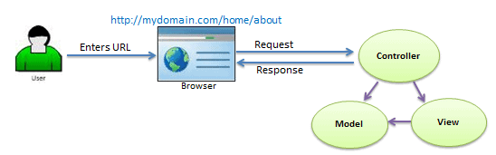
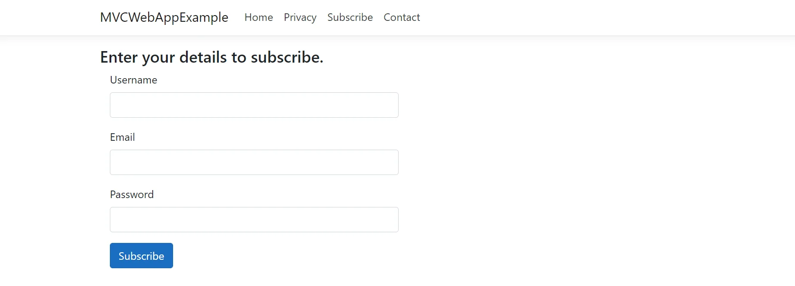

# Intro to MVC

For .NET developers, the primary and highly recommended way to integrate with Azure DevOps Services and Azure DevOps Server is 
public .NET client libraries available on Nuget. Microsoft.TeamFoundationServer.Client is the most popular Nuget package and 
contains clients for interacting with work item tracking, Git, version control, build, release management and other services.

### some standalone services 

Azure DevOps provides integrated features that good for business  next is some exambels :

1.Azure Repos: provides Git repositories or Team Foundation Version Control (TFVC) for source control of your code.

2.Azure Pipelines: provides build and release services to support continuous integration and delivery of your applications.

3.Azure Boards: delivers a suite of Agile tools to support planning and tracking work, code defects, and issues using Kanban and Scrum methods.

4.Azure Test: Plans provides several tools to test your apps, including

5.Azure Artifacts: allows teams to share packages such as Maven, npm, NuGet, and more from public and private sources and integrate package sharing into your pipelines.

### and there is some tools to use that will help you make your website:

1.Customizable team dashboards with configurable widgets to share information, progress, and trends
2.Built-in wikis for sharing information
3.Configurable notifications

### Azure DevOps Services

*Quick set-up.
*Maintenance-free operations.
*Easy collaboration across domains.
*Elastic scale.
*Rock-solid security.

## MVC

ASP.NET MVC is an open-source software from Microsoft. Its web development framework combines the features of MVC 
(Model-View-Controller) architecture, the most up-to-date ideas and techniques from Agile development and the best parts of the 
existing ASP.NET platform. This tutorial provides a complete picture of the MVC framework and teaches you how to build an 
application using this tool.

View: View in MVC is a user interface. View display model data to the user and also enables them to modify them. View in ASP.NET 
MVC is HTML, CSS, and some special syntax (Razor syntax) that makes it easy to communicate with the model and the controller.

Controller: The controller handles the user request. Typically, the user uses the view and raises an HTTP request, which will be 
handled by the controller. The controller processes the request and returns the appropriate view as a response.

*The following figure illustrates the interaction between Model, View, and Controller.*

*The following figure illustrates the flow of the user's request in ASP.NET MVC.*

### Tag Helpers

They enable server-side C# code to create and render HTML elements in razor files. We look at some examples of tag helpers and their uses, and learn how to create custom tag helpers.

in MVC the view pages responsible for creating and rendering the HTML that will be used by the browser to display the requested page, are razor files. These are the files with the .cshtml extension and contain client and server side code. When this code is executed, it will result in HTML being sent to the browser.

The code inside of razor files has two particularities. One is that it uses razor syntax, which allows us to insert C# code inside of HTML. Usually, these bits of C# code will introduce bits of logic or data that we get from the controller or the model and The second particularity, and the subject of this blog post, is the use of tag helpers.

The form tag helper will allow us to create forms. It will create the <form action="" /> attribute in the HTML code rendered in the browser, which, in an MVC web application, specifies the controller action used.

### examble for using it :

.cshtml view page looks like:

@model Subscriber

<form asp-action="Subscribe" method="post" class="form-horizontal" role="form">
    <h4>Enter your details in order to subscribe.</h4>

    

        <label asp-for="Username" class="col-md-2 control-label"></label>
        

            <input asp-for="Username" class="form-control" />
            
        

    

    

        <label asp-for="Email" class="col-md-2 control-label"></label>
        

            <input asp-for="Email" class="form-control" />
            
        

    

    

        <label asp-for="Password" class="col-md-2 control-label"></label>
        

            <input asp-for="Password" class="form-control" />
            
        

    

    

        

            <input type="submit" class="btn btn-primary" value="Subscribe" />
        

    

</form>

and This renders the following viewit will become : 

