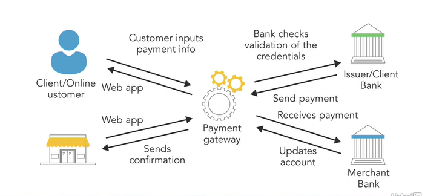

# Payment Processing

A payment gateway is an e-commerce software that authorizes payment for online merchants. it’s consumer-facing interfaces used to 
collect payments. the online stores, the payment gateways are the checkout portals used to enter the credit card information.

### Braintree Implementation :

1.Set up Braintree account

2.Set up the development environment

3.Generate client tokens

4.Card payments

### *1. Set up Braintree account :*

First of all, in our browser, we have to go to Braintreepayment.com for signup. for that Braintree will create us a sandbox 
account. so we can test the API and before to decide our push our app to production. after successfully all things, we have to 
login into sandbox.braintreegatway.com.

After the first login, when you scroll down, you will find 3 keys(MarchantId, PublicKey, PrivateKey). we actually will use these 
keys on configuring the .net core application.

### *2. Set up the development environment :*

opening the existing application, first of all, we are going to add the Braintree package. Go to NuGet to install Braintree .NET 
Client Library which is supported by both .NET Framework, .NET Core.

then we have to create an interface file in our created services folder.

To access our key’s from appsettings.json file for that we used the IConfiguration interface.

We have to configure this new service in our startup.cs file. then we are able to inject this service into our controllers.

### *3. Generates client tokens and Card payments :*

A client token contains all the necessary information to set up the client SDKs.So before that, I think it’s better to create 
some model for storing data.

Now we are generating a token and storing some data in our Controller.

if we input the test card number and expiration date, nothing will happen because we did not create Create method yet in our 
Controller.

After that, you have to create a view for success. I assumed that you will create it easily.

So now if you run the application and will click Confirm Payment. you will see your success view.

