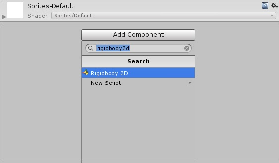
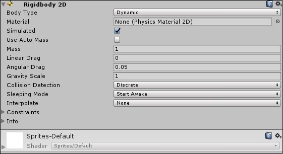
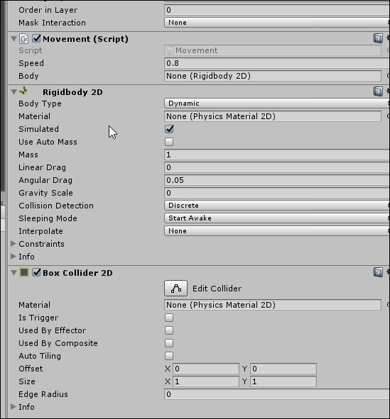

# Unity

Unity is a cross-platform game engine developed by Unity Technologies, first announced and released in June 2005 at Apple 
Worldwide Developers Conference as a Mac OS X game engine.

The main issue with the collisions in the last chapter was with the code. We will now modify the values of the GameObject’s 
position directly. We are simply adding a value to the position, if the player is pressing a key. We need a way to make the 
player move in such a way that it reacts properly to boundaries and other GameObjects.

To do so, we need to understand what rigidbodies are. Rigidbodies are components that allow a GameObject to react to real-time 
physics. This includes reactions to forces and gravity, mass, drag and momentum.

### how You can attach a Rigidbody to your GameObject

1.You can attach a Rigidbody to your GameObject by simply clicking on Add Component and typing in Rigidbody2D in the search field.

2.Clicking on Rigidbody2D will attach the component to your GameObject. Now that it is attached, you will notice that many new 
fields have opened up.

3.Clicking on Rigidbody2D will attach the component to your GameObject. Now that it is attached, you will notice that many new 
fields have opened up.

4.With the default settings, the GameObject will fall vertically down due to gravity. To avoid this, set the Gravity Scale to 0.

Now, playing the game will not show any visible difference, because the GameObject does not have anything to do with its physics 
component yet.

We can see that we create a reference to a Rigidbody2D in the declarations, and our update code works on that reference instead 
of the Object’s transform. This means that the Rigidbody has now been given the responsibility of moving.

You may expect the body reference to throw NullReferenceException, since we have not assigned anything to it. If you compile and 
run the game as is, you will get the following error on the bottom left of the editor

To fix this, let us consider the component created by the script. Remember that public properties create their own fields in 
Unity, as we did with the speed variable.

### some Properties we can use :

Mass: The mass of the object (in kilograms by default).

Drag: How much air resistance affects the object when moving from forces. 0 means no air resistance, and infinity makes the 
object stop moving immediately.

Angular Drag: How much air resistance affects the object when rotating from torque. 0 means no air resistance. Note that you 
cannot make the object stop rotating just by setting its Angular Drag to infinity.

Use Gravity: If enabled, the object is affected by gravity.

Is Kinematic: If enabled, the object will not be driven by the physics engine, and can only be manipulated by its Transform. This 
is useful for moving platforms or if you want to animate a Rigidbody that has a HingeJoint attached.

*Interpolate:*
Try one of the options only if you are seeing jerkiness in your Rigidbody’s movement.

- None: No Interpolation is applied.
- Interpolate: Transform is smoothed based on the Transform of the previous frame.
- Extrapolate: Transform is smoothed based on the estimated Transform of the next frame.

*Collision Detection:*
Used to prevent fast moving objects from passing through other objects without detecting collisions

- Discrete:	Use discrete collision detection against all other Colliders in the Scene
Other colliders will use discrete collision detection when testing for collision against it. Used for normal collisions (This is 
the default value).
- Continuous: Use Discrete collision detection against dynamic Colliders (with a Rigidbody) and sweep-based continuous 
collision detection
- Continuous Dynamic: Use sweep-based continuous collision detection against GameOjects set to Continuous and Continuous Dynamic 
collision. It will also use continuous collision detection against static Colliders (without a Rigidbody). For all other 
colliders, it uses discrete collision detection. Used for fast moving objects.
- Freeze Position: Stops the Rigidbody moving in the world X, Y and Z axes selectively.
- Freeze Rotation: Stops the Rigidbody rotating around the local X, Y and Z axes selectively.

## unity 2D Movement

### What is Rigidbody 2D ?

A Rigidbody 2D component places an object under the control of the physics engine. Many concepts familiar from the standard
 Rigidbody component carry over to Rigidbody 2D; the differences are that in 2D, objects can only move in the XY plane and can 
 only rotate on an axis perpendicular to that plane. Adding a Rigidbody 2D allows a sprite to move in a physically convincing way 
 by applying forces from the scripting API. When the appropriate collider component is also attached to the sprite Game Object,
 it is affected by collisions with other moving Game Objects. Using physics simplifies many common game play mechanics and allows
 for realistic behavior with minimal coding.

 ### What is Box Collider 2D ?
The Box Collider — An invisible shape that is used to handle physical collisions for an object. A collider doesn’t need to be 
exactly the same shape as the object’s mesh a rough approximation is often more efficient and indistinguishable in game play. 
There are lot of properties, Inherit members, public and static methods inside this.

### steps:
1.After starting a new project, (Unity will get some time to load) then we have to import our 2D model to the Unity screen. This 
time I am using a default Sprite provided by unity. We can do this by right clicking on the Hierarchy window and selecting new 2d 
object.

2.Then it will be on our Scene layout and I did some adjustments like changing the size and color, Changing the Sprite shape to a 
Cube, like that..

3.Then We have to add 2 main components to make sure everything works fine after. Those two are Rigidbody 2D and Box Collider 2D.
 On the inspector window/panel there is a button called Add Components. Click on that and we can select those two attributes to 
 our main Character(square)

## 

Unity handles collision between GameObjects with colliders, which attach to GameObjects and define the shape of a GameObject
 for the purposes of physical collisions. A collider is invisible, and does not need to be the exact same shape as the 
 GameObject’s mesh. A rough approximation of the mesh is often more efficient and indistinguishable in gameplay.

### Compound colliders
Compound colliders approximate the shape of a GameObject while keeping a low processor overhead. To get further flexibility, you 
can add additional colliders on child GameObjects. For instance, you can rotate boxes relative to the local axes of the parent 
GameObject. When you create a compound collider like this, you should only use one Rigidbody
 component, placed on the root GameObject in the hierarchy.

Primitive colliders do not work correctly with shear transforms. If you use a combination of rotations and non-uniform scales in 
the Transform hierarchy so that the resulting shape is no longer a primitive shape, the primitive collider cannot represent it 
correctly.

### Mesh colliders
There are some cases, however, where even compound colliders are not accurate enough. In 3D, you can use Mesh Colliders
 to match the shape of the GameObject’s mesh exactly. In 2D, the Polygon Collider 2D does not match the shape of the sprite
 graphic perfectly but you can refine the shape to any level of detail
 you like.

### Static colliders
You can add colliders to a GameObject without a Rigidbody component to create floors, walls and other motionless elements of a 
Scene. These are referred to as static colliders. At the opposite, colliders on a GameObject that has a Rigidbody are known as 
dynamic colliders. Static colliders can interact with dynamic colliders but since they don’t have a Rigidbody, they don’t move in 
response to collisions.

### Physics materials
When colliders interact, their surfaces need to simulate the properties of the material they are supposed to represent. For 
example, a sheet of ice will be slippery while a rubber ball will offer a lot of friction and be very bouncy. Although the shape 
of colliders is not deformed during collisions, their friction and bounce can be configured using Physics Materials. Getting the 
parameters just right can involve a bit of trial and error. A slippery material like ice, for example, has zero (or very low) 
friction. A grippy material like rubber has high friction and near-perfect bounciness. See the reference pages for Physic 
Material and Physics Material 2D for further details on the available parameters. Note that for historical reasons, the 3D asset 
is actually called Physic Material but the 2D equivalent is called Physics Material 2DUse to adjust the friction and bounce that 
occurs between 2D physics objects when they collide More info See in Glossary 

### Triggers
The scripting system can detect when collisions occur and initiate actions using the OnCollisionEnter function. However, you can 
also use the physics engine simply to detect when one collider enters the space of another without creating a collision. A 
collider configured as a Trigger (using the Is Trigger property) does not behave as a solid object and will simply allow other 
colliders to pass through. When a  collider enters its space, a trigger will call the OnTriggerEnter function on the trigger 
object’s scripts.