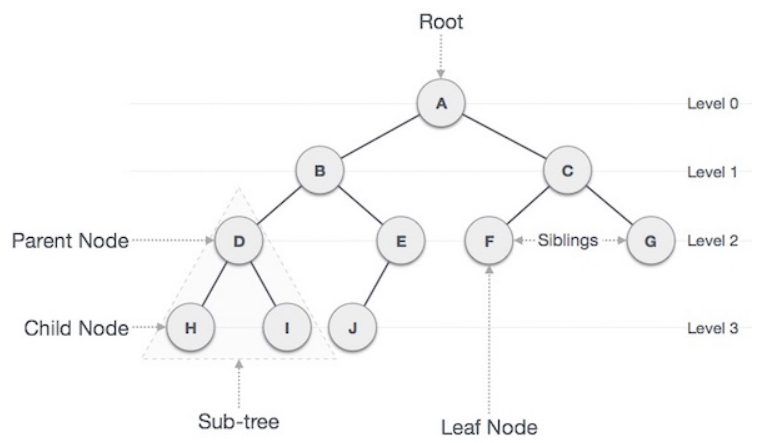

# Tree
A Tree is a non-linear data structure that represents the nodes connected by edges, node it’s like an item or element in an Array which contains data. 

### points of Tree in Data Structure:

1.A tree data structure is defined as a collection of objects or entities known as nodes that are linked together to represent or simulate hierarchy.

2.A tree data structure is a non-linear data structure because it does not store in a sequential manner.

3.The topmost node is known as a root node. Each node contains some data, and data can be of any type.

## tree structure:

## tree elements:

1.Root: The node at the topmost of the tree, and does not have a parent.
2.Parent Node: Any node has one edge and upward to a node except the Rood node ex:  Node {B, C, D, E} are parents.
3.Child Nod;e The node is downward of any node ex: Node {D, E} are children of B.
4.Leaf: The node that does not have any child node.
5.Edge: The connection between one node to another. It’s a line between two nodes.
6.Siblings: The nodes with the same parent.
7.Sub-tree: The parent node and his children this called sub-tree. 
8.Depth :The count of edges from the root to the node.
9.Height: The number of edges on the longest path from that node to a leaf. If you want the height of the tree it’s the height of the root.
10.Ancestor: Any predecessor node on a path from the root to that node. The root node doesn't have any ancestors.
11.Level of node The count of edges on the path from the root node to that node. Allows root in level zero.
12.Keys: The value of a node based on which a search operation is to be carried out for a node.

### Traversals
has twop ways :Pre-order,In-order,Post-order.
1.Depth First
2.Breadth First

### Type of tree Data Structure:

1.Binary tree: Binary Search Tree, AVL Tree,
2.B tree.
3.Multiway tree.
4.Application-specific tree.

